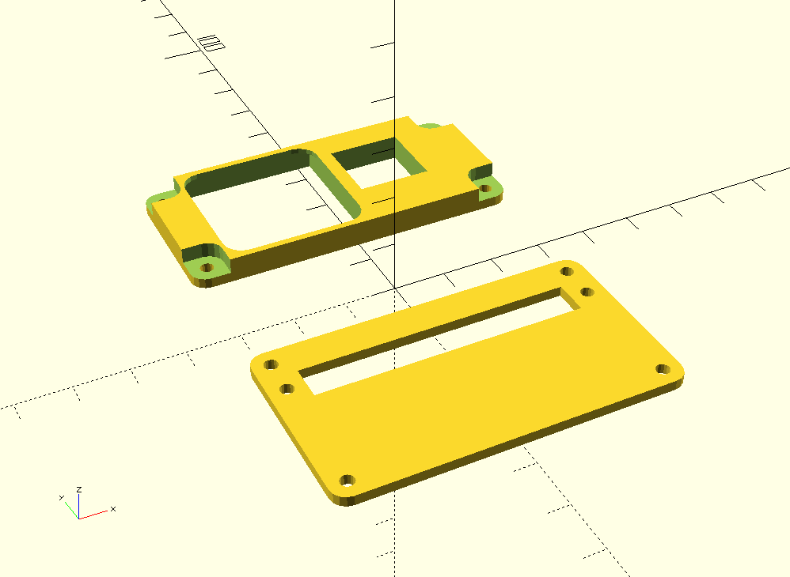
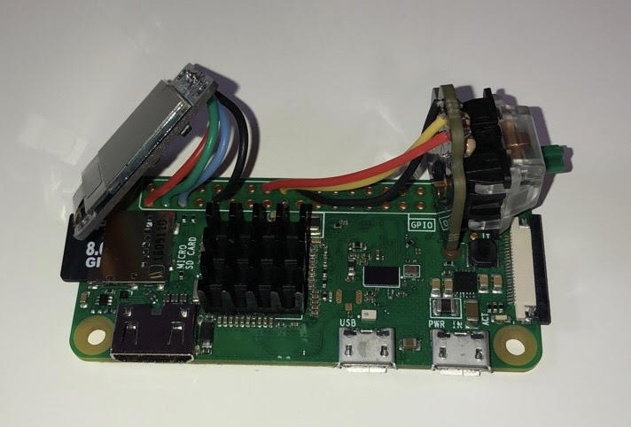
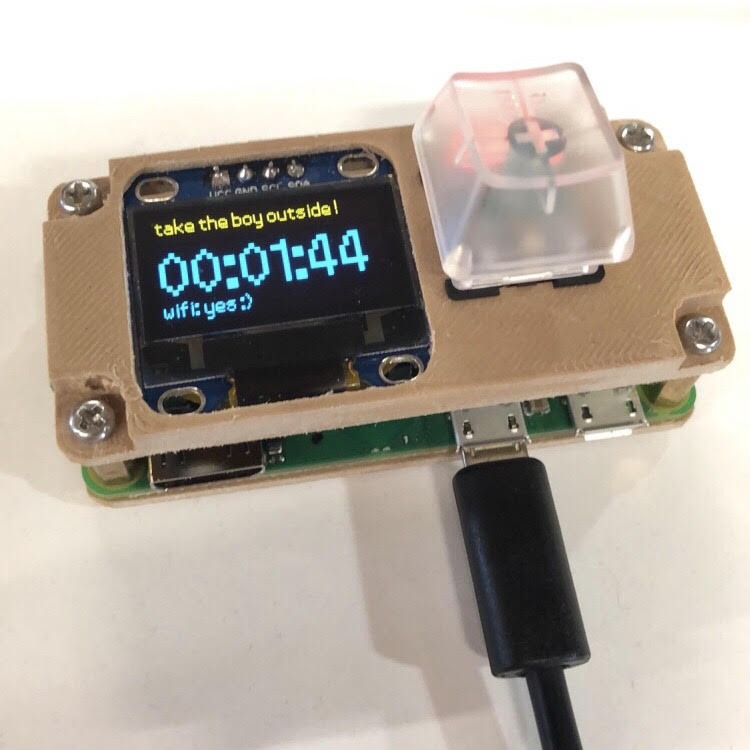

# Tater Timer

We've got an little boy named Tater Tot.

He's a good boy, but he had a rough life before he came to us. As a result, he never tells us when he needs to go outside, and if we wait too long, he'll just sneak off and go somewhere in the house.

The idea with the Tater Timer is to have a device that tracks how long it's been since he went out. In true silly side project fashion, this has been made harder than it needed to be - it's a pi zero with a small screen and a single button attached.

## Photos

### Case model

### Board post-initial-solder, pre-case-assembly

### Assembled and working

## Setup

### pi-side

Set up raspbian (squeeze) on a pi, do your raspi-config business, clone this repo, then:

1. `cd pi`
2. `./setup.sh`

The screen is a runs on SSD1306 using [Adafruit's library](https://github.com/adafruit/Adafruit_SSD1306). [They've got a solid screen](https://www.adafruit.com/product/326) - the pictured one's a cheapo. The key is on GPIO 23 (BCM numbering) and the LED is on GPIO 24.

### server-side

Assuming debian-based distro + systemd - clone this repo, then: 

1. `cd server`
2. `./setup.sh`

## Postmortem-ish thoughts

* Obviously, I cut some corners, here. A more-robust solution could use lambda and dynamodb and stay within AWS's free tier easily.
* You're welcome to 3d print my case, but it likely won't fit your parts. I used some custom stuff that I had around from previous projects.
* I really wish our boy had a bigger bladder.
